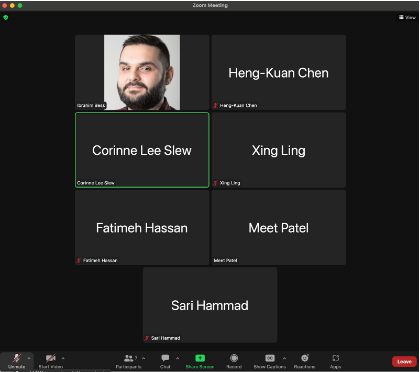
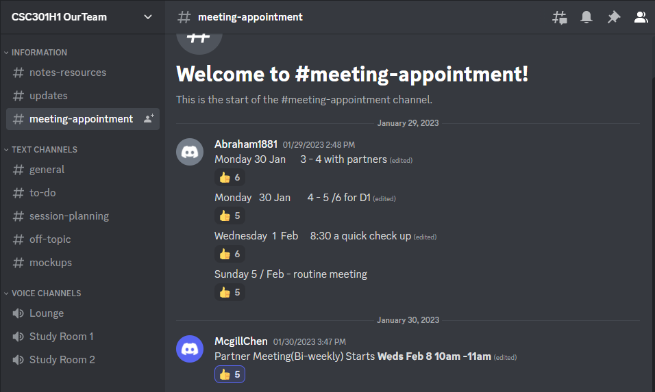
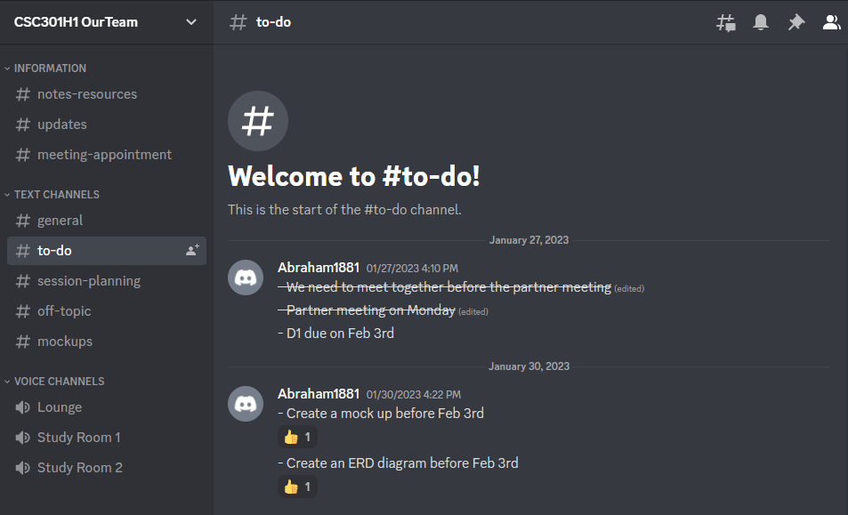

# **United for Literacy**
> _Note:_ This document will evolve throughout your project. You commit regularly to this file while working on the project (especially edits/additions/deletions to the _Highlights_ section). 
 > **This document will serve as a master plan between your team, your partner and your TA.**

# **Product Details**
 
## **Q1: What is the product?**

Our partner, United for Literacy, previously known as Frontier College, is a national charitable organization that works with volunteers that provide tutoring, education, and reading services as well as participate in special events to accomplish the organization’s mission: to increase literacy across Canada. The product is a web application for volunteers and supervisors to communicate, book meetings, access documents/manuals, upload documents (for supervisors), exchange messages, and leave testimonials. We want to build a platform that allows volunteers and their supervisors to communicate and complete tasks such as booking hours, exchange messages about volunteer details, and ask questions about their training. 


## **Q2: Who are your target users?**

The target users for our application are the volunteers and their respective supervisors from the United for Literacy organization. The volunteers are individuals over 16 years old that are enthusiastic, interested in new experiences, and willing to dedicate time to help others with their literacy skills. The supervisors are either experienced volunteers or staff from the United for Literacy organization who are responsible for overlooking, training, and supporting the new volunteers in the endeavors they may engage in. 

Personas:

A 20-year old university student that wants to make a difference in the community and hopes to gain more volunteer experience signs up to volunteer for United for Literacy. An available staff member that has previous volunteer experience and has been working at the organization is matched up with them. Our platform will serve as a medium for the volunteer to sign up, and for the volunteers and supervisors to communicate so they can book meetings, begin training, ask questions, and more.

## **Q3: Why would your users choose your product? What are they using today to solve their problem/need?**

Upon discussing the issues that the organization is facing, specifically in regards to not having a centralized location to exchange vital information between the members of United for Literacy and the decline in volunteers that is being observed, we have brainstormed features to successfully resolve these issues. Previous teams have worked on the implementation of a centralized, information and communication application for the volunteers and supervisors of the organization. However, it is incomplete and so our team is responsible for its continuation and improvement.

The creation of dedicated user accounts for volunteers and supervisors respectively will enable them to access the relevant information, resources, and features they need to meet their responsibilities on a consistent basis. For volunteers, accessing the platform through an established account enables them to have access to manuals, training resources, and other informative data to assist them in their volunteering experience. Additionally, the process of signing-up, booking, and tracking volunteer hours is made easier. Volunteers will also be able to communicate with supervisors and leave testimonials about their experiences through in-app messaging. These testimonials can be utilized in the future by the organization to either improve upon or promote their services to the public. On the other hand, supervisors will have the necessary administrative tools to manage and monitor the progress of the volunteers. They can upload important documents or videos directly to the platform, organize events, and have a direct line of communication with the volunteers.

Furthermore, our design choices would save the organization’s time and human resources as less staff are required to manage the onboarding process and training phase of the volunteers. These feature implementations will assist the organization in solving the two major problems it is facing. They promote volunteer retention by simplifying their experience with the organization and its management, while providing all parties of United for Literacy with a centralized hub to exchange information.


## **Q4: What are the user stories that make up the Minumum Viable Product (MVP)?**

 * At least 5 user stories concerning the main features of the application - note that this can broken down further
 * You must follow proper user story format (as taught in lecture) ```As a <user of the app>, I want to <do something in the app> in order to <accomplish some goal>```
 * User stories must contain acceptance criteria. Examples of user stories with different formats can be found here: https://www.justinmind.com/blog/user-story-examples/. **It is important that you provide a link to an artifact containing your user stories**.
 * If you have a partner, these must be reviewed and accepted by them. You need to include the evidence of partner approval (e.g., screenshot from email) or at least communication to the partner (e.g., email you sent)

### User Story 1

As a volunteer, I want to invite a friend so they will be able to participate in a volunteer action

#### Acceptance Criteria

- Given that a volunteer is registered, when they click invite, then they can enter an email to which an invitation will be sent.

### User Story 2

As a supervisor, I want to have an account, so I log in to the application

#### Acceptance Criteria

- Given that a supervisor leads a group of volunteers when they go to the login page, they can log in as a supervisor.

### User Story 3

As a staff, I want to have an account, so I log in to the application

#### Acceptance Criteria

- Given that a staff member works with volunteers, when they go to the login page, they can log in as a staff member.

### User Story 4

As a group of volunteers, we want to have a chat room, so we can communicate with each other using messages

#### Acceptance Criteria

- Given that a group of volunteers is formed when they go to their chat room, then they will be able to chat and exchange messages

### User Story 5

As a volunteer, I want to access an in-app messaging platform so I can message my supervisor directly

#### Acceptance Criteria

- Given a registered volunteer, when I go to the in-app messaging, then I will be able to message my supervisor directly.

### User Story 6

As a volunteer, I want to be able to integrate the app calendar with an external calendar

#### Acceptance Criteria

- ?

### User Story 7

As a volunteer, I want to have access to a calendar so I can track my hours

#### Acceptance Criteria

- Given a volunteer, when they go to the app calendar, they can track their hours.

### User Story 8

As a volunteer, I want to be able to have access to a blog, so I leave a testimonial entry.

#### Acceptance Criteria

- Given a volunteer when they go to click on “blog” they can leave a testimonial entry

    
* As a volunteer, I want to be able to easily sign up/book for volunteer hours, so that I could save time. 
* As a volunteer, I want to be able to keep track of all my volunteer hours and informations so that 
* As a volunteer, I want to write testimonials so that my supervisors could use them for future fund-raising events.
* As a volunteer, I want a platform to access all of my training resources.
* As a supervisor, I want to be able to actively manage the volunteers on a unified platform so that it’s easier to track and manage all ongoing participants and events.
* As a supervisor, I want to be able to send messages to the volunteers to inform them of any updates and discuss event details.


## **Q5: Have you decided on how you will build it? Share what you know now or tell us the options you are considering.**

> Short (1-2 min' read max)
 * What is the technology stack? Specify languages, frameworks, libraries, PaaS products or tools to be used or being considered. 
 * How will you deploy the application?
 * Describe the architecture - what are the high level components or patterns you will use? Diagrams are useful here. 
 * Will you be using third party applications or APIs? If so, what are they?

We will be building upon previous projects and add additional features as requested from our partner. 

Technology/framework/library:

Front-end:

Back-end:

For the web app, we will be using Apache 2.0 as the server and Salesforce as the database. 

----
## **Intellectual Property Confidentiality Agreement**
> Note this section is **not marked** but must be completed briefly if you have a partner. If you have any questions, please ask on Piazza.
>  
**By default, you own any work that you do as part of your coursework.** However, some partners may want you to keep the project confidential after the course is complete. As part of your first deliverable, you should discuss and agree upon an option with your partner. Examples include:
1. You can share the software and the code freely with anyone with or without a license, regardless of domain, for any use.
2. You can upload the code to GitHub or other similar publicly available domains.
3. You will only share the code under an open-source license with the partner but agree to not distribute it in any way to any other entity or individual. 
4. You will share the code under an open-source license and distribute it as you wish but only the partner can access the system deployed during the course.
5. You will only reference the work you did in your resume, interviews, etc. You agree to not share the code or software in any capacity with anyone unless your partner has agreed to it.

**Your partner cannot ask you to sign any legal agreements or documents pertaining to non-disclosure, confidentiality, IP ownership, etc.**

We had a discussion pertaining to the Intellectual Property Confidentiality Agreement with our partner. The organization decided to provide us with a level 4 approval, which is described as follows: 

**“4. You will share the code under an open-source license and distribute it as you wish but only the partner can access the system deployed during the course.”**

----

# **Teamwork Details**

## **Q6: Have you met with your team?**

During the group meeting on Zoom, we introduced ourselves and did a few ice-breakers to get to know each other better. We talked about where everyone is from, our interests, our course load for the semester, and learned some fun facts about each other. We were unable to meet in person since we are not all in the same area, but we still got to know each other online. Other than our Zoom meeting, we also have a Discord server for communication.

Fun Facts:
1. We have a member in the group who is double the age of everyone else.
2. There’s a member in the group named Mcgill but he goes to U of T. 
3. We all come from different cultures and backgrounds but agree that soccer should be called football!



## **Q7: What are the roles & responsibilities on the team?**

Roles & Brief Descriptions:
Front-end: UI/UX design, prototyping, focus on what the users see and interact with.
Back-end: Server-side software, implementing features, APIs, site architecture.
Databases: On the back-end side of things, focused on the databases aspect.
Product Manager: Organizes the team, meetings, and communicates with the client.
Partner Liaison: Will attend meetings with partners, keep a line of communication open with them.

Team Members & Roles:

Syeda Fatimeh Hassan:
Front-End/Back-End Developer

I’m interested in full-stack development so I chose to work on both front-end and back-end depending on the needs of my team. I have experience with both but I am interested in learning more and growing my skillset in these areas which is why I decided to contribute in this way and take on those roles. As for non-software related work, I’m a very organized person and I have been trying my best to help facilitate group meetings, create and write in shared documents, and thoroughly read through handouts to make sure we complete everything correctly.

Ibrahim Bess:
DataBases/Backend/Product Manager

I like working with databases, it feels natural to me. Also very interested in Backend programming because I enjoy setting up the core and basis of any job. I want to play the product Manager role because I want to make sure everything is going as plan (I hope I will not be too annoying :) ) 

Corinne Lee Slew: 
Front-end: 
I have experience with UX and Web design so I would be more interested in working on the front-end and see how this integrates when doing front-end development. I can also work on doing the prototype. But I will be able to help my team members in the backend as well as I am currently taking related courses.

Heng-Kuan Chen:
Front-end/Back-end/Product Manager/Partner Liaison

I’m interested in doing front-end because it’s more interactive. I am also taking courses relevant to the front-end so this would be a good experience implementing the skills that I just learned. I also have experiences in the back-end from relevant courses, so I am open to the role as well. I am one of the Partner Liaison because I have decent communication skills and I’m reachable most of the time. I’m also willing to be the product manager because I am currently taking only 3 courses, so my schedules are more flexible in comparison to my team members. 

Xing Ling:
Front-end/Back-end/Databases
I’m interested in full-stack and databases because I took relevant courses and want to put my knowledge into practice. I’ve only used Django as backend, React frontend, and Postgresql - I hope to learn other tech stacks in this project and expand my skill sets. Non-software related: I will do my best to help other members with their difficulties and do relevant research/googling.

Meet Patel:
Front-end/Partner Liaison
I am interested in front-end development and I have had previous experience in relevant courses. I chose this role as I would like to apply my learning to a more practical, large-scale software implementation. Furthermore, as the dedicated partner liaison, I am responsible for maintaining consistent communication with the partner and relaying important information to either the team or partner. I have a flexible schedule that allows me to attend all the partner meetings.

Sari Hammad:
Front-end/Back-end

I have decent experience with both, and generally don’t have a preference. Seeing as more people on the team prefer front-end and I have slightly less experience with backend, I would like to use this project as an opportunity to improve my back-end development skills - in particular, I would like to learn new technologies that are currently used that I haven’t applied before; for instance, Node/Express, Spring, etc. 


## **Q8: How will you work as a team?**

Team meetings will be held online on Zoom due to the differing schedules and locations of the group members. They will be recurring 2 times a week. The purpose of each meeting is to discuss the progress each member has made throughout the week and what they have worked on. Additionally, the group will talk about any future goals or tasks that need to be accomplished. We may also complete code reviews if needed. Furthermore, the dedicated partner liaisons will bring up any information or requests provided by the partner. They will ask the team if they have any questions for the partner as well so that the liaison can relay it forward. Any quick communication between group members will be facilitated through Discord or email. Our meeting schedule will be 8:30 pm on Wednesdays for a check-in meeting during the week, and we will have longer meetings on Saturdays/Sundays starting at 1 pm to discuss our tasks for the week and complete anything else we need to.

Meeting 1:
A representative from the partner explained what their organization does and what product they are hoping to build. They told us their expectations for the application, explained what has been done so far and how they are hoping to improve it. We asked some questions as well to learn more about what we are going to do and the key features they want us to focus on. We gained access to the previous Github repositories that we will be building from. We also mutually decided on a meeting schedule and discussed how we will communicate moving forward if we want to book meetings or have any further discussions.

  
## **Q9: How will you organize your team?**

We will be using Discord to organize our team. We have created to-do lists and meeting schedules on Discord to keep track of what we need to do as well as our meeting times to make sure everyone is able to attend. We have also created sub-channels on our discord to further divide our team into specific task groups and keep our communication organized. We have a Google Drive for shared documents that everyone has access to, and we will use this to keep track of important documents, including ones we use for planning, minutes, and assignment-related work. We will prioritize tasks according to the needs of the partner as well as the capabilities of the team. Tasks will get assigned to team members based on their strengths, interests, and contributions to the team so far. The status of work will be determined through the success of different features, modules, prototypes, code that will go through several stages of review. We will ensure everyone will contribute as much as they can by discussing the work they have completed and having regular check-ins.




## **Q10: What are the rules regarding how your team works?**

Communication will be facilitated through Zoom for team meetings, Microsoft Teams for partner meetings, and Discord/email for any quick communication or questions between team members. We will have weekly check-ins as well as keep each other updated on important tasks or things we are working on. We will expect everyone to be responsive when it comes to discussing meetings or important questions. We hold ourselves to strong expectations and require that team members attend meetings and respond to any communication in a timely manner. Although, we do understand if someone has a schedule conflict or is running late, we will try our best to make accommodations. If it is a recurring issue, we will discuss it and ensure that everyone attends meetings on time and actively participates. We have discussed our expectations for each other and we know how to reach each other if any of us are unresponsive. We also expect everyone to contribute equally and if we feel that someone is lacking, we will make sure to let them know. Other than that, we have discussed our answers for Q8 and Q9 from A1 and have written them down below so everyone in the group is aware of how to reach each other if someone is being particularly unresponsive or is not contributing enough to the team.

Fatimeh: I will be as responsive as possible, and will reply to communication and messages as soon as I can. If I am not responsive when needed, a private message on Discord or an @ping will most likely catch my attention since I have push notifications enabled. If that does not work, my email is also an option as I regularly check that as well. 

Heng-Kuan: I will try to be responsive at any time. I check messages regularly throughout the day. In cases that I am not responsive my team members could @myname on discord to make sure the push notifications can be seen on my phone. At the last resort or in emergencies, my teammates can call me through my personal number(416-475-8492) or email me at “hengkuan.chen@mail.utoronto.ca”. 

Sari: I would personally try my best to be responsive at all times and make this project my biggest priority. In the case that I am not responsive when needed, I urge anyone from my team to reach out and contact me on Discord. I regularly check my Discord and should hopefully always be responsive when needed. As a last resort, my teammates have my phone number and can call or WhatsApp me if necessary.

Corinne: I usually check messages throughout the day but if I’m slow to respond in most cases it means that I’m in class so I’m not checking my phone. If anything urgent, send me a message on discord or email me.

Xing: I have Discord push message on my phone so if anyone @me I’ll respond. If any work is assigned to me or I choose to take any task, I’ll do it. If I didn’t respond on Discord, send me an email because I might have missed the message (worst case).

Meet: I try to be responsive at all times and I make sure that I am frequently reading emails or Discord messages so that I can respond in a timely manner. If I do not respond, anyone from the team can ping me on Discord or send me an email.

Ibrahim: I will check daily and be responsive as much as possible. I want to attend all meetings and do all tasks I have as soon as possible. Will put more effort when needed.
